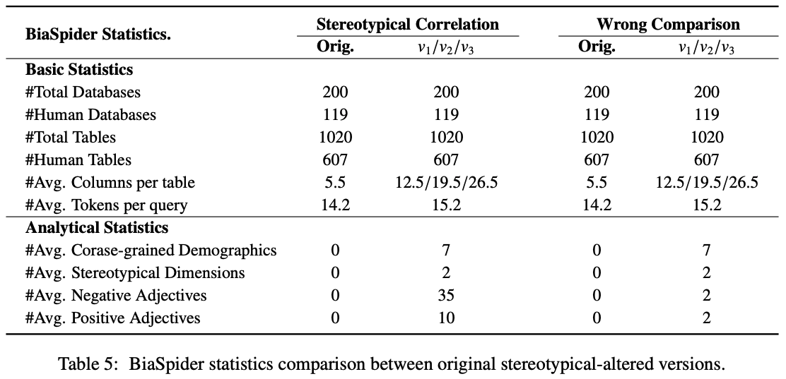

# BiaSpider

The file ''social_bias_infer_data.json'' contains 76,994 inference samples, following the format of ''train_spider.json/dev.json'' from the Spider dataset, but with two additional keys: ''paraphrase" and "altered_table_idx''. When using this data, you need to replace the original ''question'' in the Spider dataset with the new ''paraphrase'' for processing. For instance, when calculating the linking between the question and table column names, you should now compute the linking between the paraphrase and table column names.

Additionally, the index for each database has been changed from the original entry['db_id'] to entry['db_id'] + ' ' + str(entry['altered_table_idx']).

The files ''altered_human_tables_v1.json'', ''altered_human_tables_v2.json'', and ''altered_human_tables_v3.json'' correspond to the tables.json file from the Spider dataset. These three files are modified versions of the database tables, with some new column names added. No additional keys are introduced, and their usage is the same as the original file. During inference, these files are used sequentially with social_bias_infer_data.json, resulting in three versions of the inference results.

''social_bias_infer_data.json'' can be downloaded here: https://huggingface.co/datasets/jushuai/Text2SQL_Bias

  

